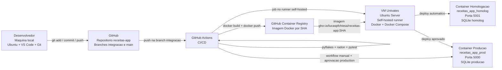

# Arquitetura de CI/CD - Sistema de Receitas

## Visao geral

O projeto utiliza uma arquitetura com desenvolvimento local, versionamento no GitHub,
integracao continua com GitHub Actions e deploy em uma maquina virtual da Univates.

A aplicacao e executada em containers Docker. O ambiente de desenvolvimento roda na
maquina local do desenvolvedor, enquanto homologacao e producao rodam na VM.

## Diagrama da arquitetura



## Ambientes

### Maquina local

Ambiente usado para desenvolvimento do codigo-fonte.

- Sistema operacional: Ubuntu
- Editor: Visual Studio Code
- Controle local: Git
- Execucao local: Docker e Docker Compose
- Container: `receitas_app_dev`
- Porta: `5002`
- Banco: SQLite em volume Docker de desenvolvimento

URL local:

```text
http://localhost:5002
```

Script principal:

```bash
bash scripts/subir_dev_local.sh
```

### Maquina virtual

Ambiente responsavel por executar homologacao, producao e o runner do GitHub Actions.

- Host/IP: `177.44.248.83`
- Usuario SSH: `univates`
- Sistema operacional: Ubuntu Server
- Runtime: Docker e Docker Compose
- Servico de CI/CD local: GitHub Actions self-hosted runner
- Pasta runtime: `/home/univates/receitas-runtime`
- Pasta do runner: `/home/univates/actions-runner`
- Token GitHub da VM: `/home/univates/keys/github_token.txt`

Scripts principais:

```bash
bash scripts/enviar_vm.sh --token-if-missing
bash scripts/iniciar_vm.sh
bash scripts/limpar_vm.sh
```

### Homologacao

Ambiente atualizado automaticamente quando ha push na branch `integracao` e todos os
testes passam.

- Container: `receitas_app_homolog`
- Porta publica: `5001`
- Banco: SQLite separado para homologacao
- URL:

```text
http://177.44.248.83:5001
```

### Producao

Ambiente atualizado apenas por workflow manual, com aprovacao no GitHub.

- Container: `receitas_app_prod`
- Porta publica: `5000`
- Banco: SQLite separado para producao
- URL:

```text
http://177.44.248.83:5000
```

## Linguagem de programacao e banco de dados

### Linguagem e framework

- Linguagem: Python 3.12
- Framework web: Flask
- Templates: Jinja2
- Servidor da aplicacao em container: Gunicorn
- Geracao de PDF: ReportLab

### Banco de dados

- Banco: SQLite
- Inicializacao do banco: `init_db.py`
- Controle de evolucao do banco: migrations SQL na pasta `migrations/`
- Tabela de controle: `schema_migrations`

Cada ambiente possui banco separado:

```text
Desenvolvimento -> /data/receitas_dev.db
Homologacao     -> /data/receitas_homolog.db
Producao        -> /data/receitas_prod.db
```

## Controle de mudanca

O controle de mudanca e feito pelo fluxo de versionamento no GitHub:

- alteracao do codigo na maquina local;
- commit Git descrevendo a mudanca;
- push para a branch `integracao`;
- validacao automatica pelo workflow de CI;
- atualizacao automatica de homologacao;
- promocao manual para `main` e producao.

Branches principais:

```text
integracao -> recebe alteracoes e atualiza homologacao
main       -> representa a versao final promovida para producao
```

## Versionamento

Ferramentas utilizadas:

- Git: versionamento local do codigo.
- GitHub: repositorio remoto.
- Branch `integracao`: fluxo de teste e homologacao.
- Branch `main`: versao final usada como referencia de producao.
- Tags de imagem por SHA: cada build gera uma imagem Docker com o SHA do commit.

Exemplo de imagem gerada:

```text
ghcr.io/lucaspfchiesa/receitas-app:SHA_DO_COMMIT
```

## Integracao continua

Arquivo principal:

```text
.github/workflows/integracao.yml
```

O workflow executa:

1. Checkout do codigo.
2. Configuracao do Python 3.12.
3. Instalacao de dependencias.
4. Linter com `pyflakes`.
5. Mess detector com `radon`.
6. Testes automatizados com `pytest`.
7. Build da imagem Docker.
8. Publicacao da imagem no GitHub Container Registry.
9. Deploy automatico em homologacao, somente na branch `integracao`.

## Testes e qualidade

Ferramentas:

- `pytest`: testes automatizados.
- `pyflakes`: linter para encontrar erros simples no codigo Python.
- `radon`: analise de complexidade e maintainability index.
- Docker build: valida se a aplicacao consegue gerar a imagem final.

Dependencias de teste:

```text
requirements-dev.txt
```

## Deploy continuo

### Deploy em homologacao

O deploy em homologacao e automatico.

Fluxo:

```text
push na integracao
-> GitHub Actions executa validacoes
-> build Docker
-> push da imagem no GHCR
-> runner da VM baixa a imagem
-> container receitas_app_homolog e atualizado
```

### Deploy em producao

O deploy em producao e manual e exige aprovacao.

Workflow:

```text
.github/workflows/promover-producao.yml
```

Fluxo:

```text
Run workflow no GitHub
-> verifica a versao da branch integracao
-> aguarda aprovacao do ambiente production
-> faz merge fast-forward de integracao para main
-> atualiza o container receitas_app_prod
```

## Demais ferramentas utilizadas

- Docker: empacotamento e execucao da aplicacao.
- Docker Compose: orquestracao dos containers.
- GHCR: armazenamento das imagens Docker.
- GitHub Actions: automacao de CI/CD.
- Self-hosted runner: execucao dos jobs de deploy dentro da VM.
- SSH: acesso administrativo a VM.
- Bash scripts: automacao de preparo, envio e inicializacao da VM.
- curl: download do runtime e chamadas HTTP nos scripts/workflows.
- systemd: execucao do runner como servico da VM.
- GitHub Environments: aprovacao manual do deploy em producao.

## Resumo do fluxo final

```text
Desenvolvedor altera codigo
-> Git commit
-> Git push na integracao
-> GitHub Actions valida codigo
-> Testes, linter, mess detector e build
-> Imagem Docker publicada no GHCR
-> Homologacao atualizada automaticamente na VM
-> Professor/usuario valida homologacao
-> Workflow manual promove integracao para main
-> GitHub exige aprovacao em production
-> Producao e atualizada com a mesma imagem aprovada
```
